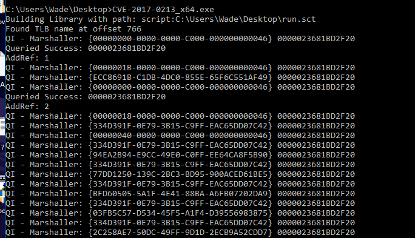

# Retro

## Escaneo de puertos

Ejecutamos el siguiente comando de`nmap`para identificar los puertos abiertos de la máquina vulnerable.

```
nmap -sV -sC 10.10.148.134
```

Tenemos dos servicios funcionando en la máquina obtenido: El puerto 80 de HTTP y el 3389 de RDP.


## Fuzzing web

Accedemos a la página web.


Hacemos un ataque de fuerza bruta a los directorios con la herramienta`dirbuster`.


Obtenemos el directorio de `/retro`y una consola de administración de WordPress`/wp-admin`.


Accedemos al directorio de`/retro`.

http://10.10.148.134/retro/


Hacemos clic en el usuario`Wade`.


Vemos que `Wade`ha comentado recientemente en el blog de "Ready Player One".


Encontramos la posible contraseña de`Wade`: `parzival`


Accedemos a través del servicio de RDP con las credenciales.

```
xfreerdp /u:wade /p:parzival /v:10.10.148.134
```


Se nos abre el acceso remoto al cliente de Wade.


Obtenemos el`user.txt`.


```
3b99fbdc6d430bfb51c72c651a261927
```

## Escalada de privilegios

Entramos a Chrome y en las bookmarks tenemos el CVE.


```
CVE-2019-1388
```

En la papelera de reciclaje también hay un programa llamado`hhupd`.


Lo restauramos y lo ejecutamos.

Nos solicita las credenciales del administrador pero le hacemos clic en "Show more details".


Y luego "Show Information about the publisher's certificate".


Vamos al enlace hacia el navegador donde pone "Issued by: ...".


Como la máquina no funciona bien, introducimos la URL manualmente en Internet Explorer.


No podemos acceder a la página que es lo normal.


En en engranaje de arriba, le damos a "File" y luego "Save as" para intentar guardar la página.


Escribimos lo siguiente arriba:

```
C:\Windows\System32
```

Y también en "File name":

```
*.*
```


Buscamos el cmd y lo ejecutamos (clic derecho y "Open").


Debido a que no funciona correctamente el exploit.


Nos lo descargamos de la siguiente URL de github.

https://github.com/SecWiki/windows-kernel-exploits/tree/master/CVE-2017-0213

Lo descargamos y lo descomprimimos.


Luego, simplemente, lo pegamos directamente en la sesión abierta de antes.


Abrimos el cmd y lo ejecutamos.

```
CVE-2017-0213_x64.exe
```


La escalada de privilegios ha tenido éxito.


La última flag se encuentra aquí.


```
7958b569565d7bd88d10c6f22d1c4063
```


